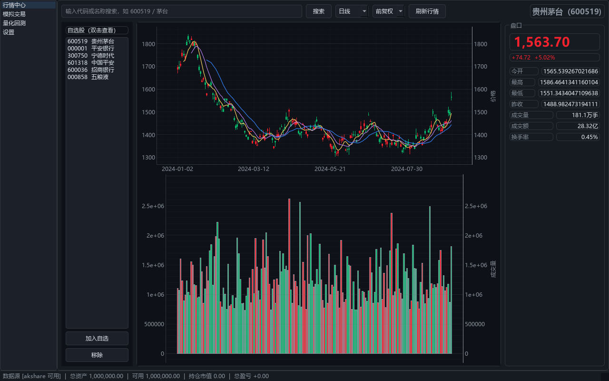
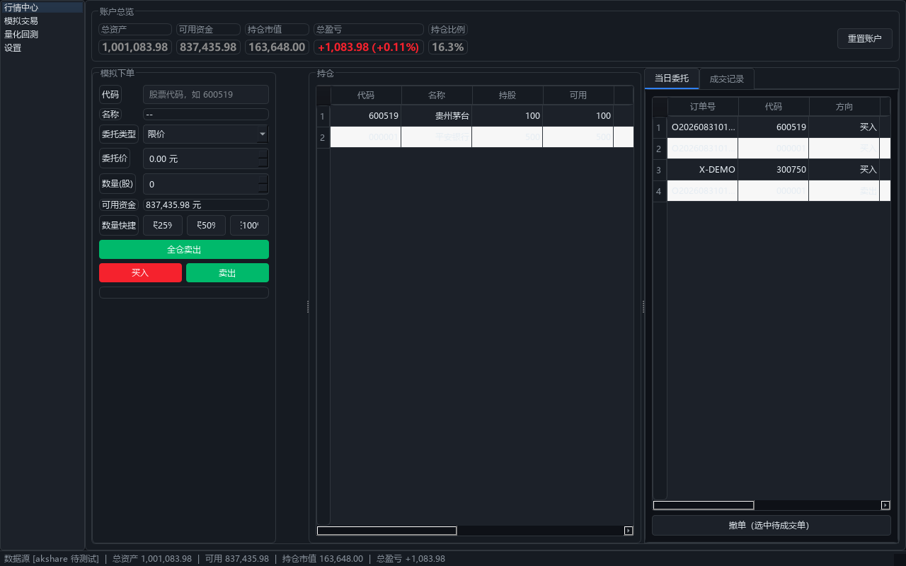
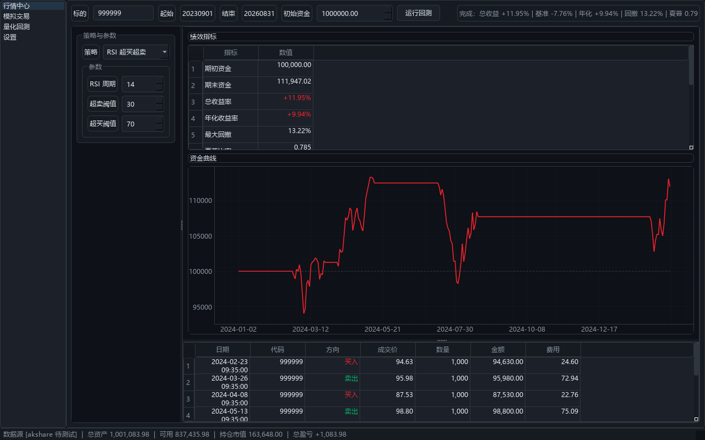
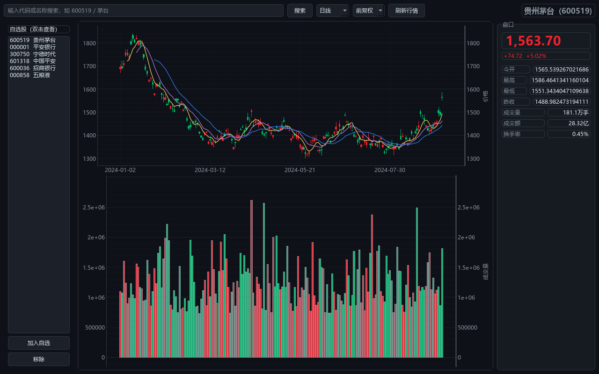
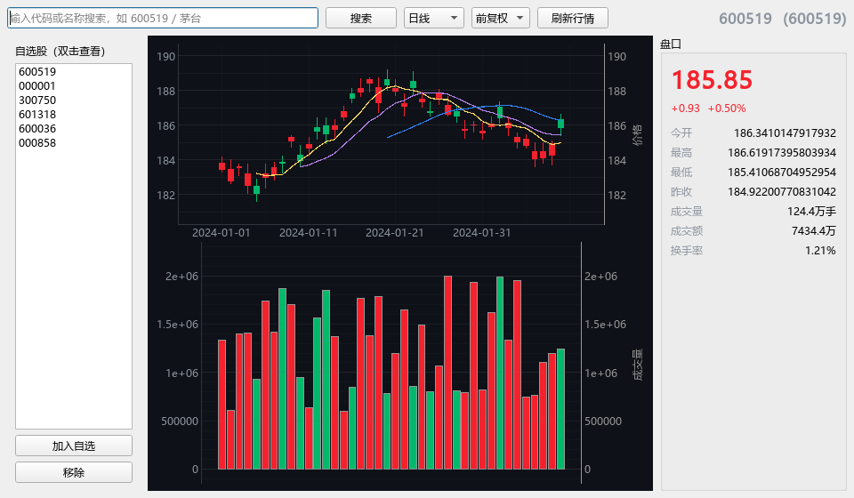
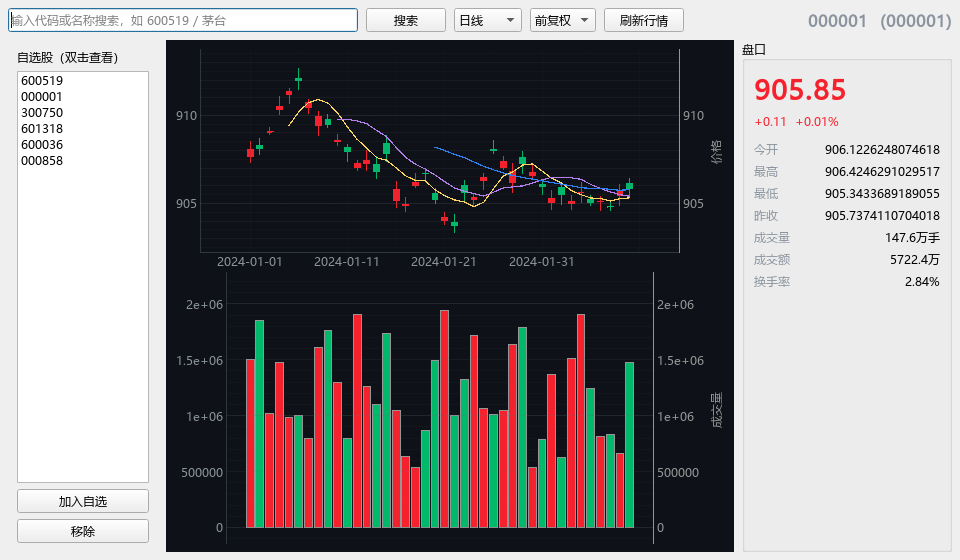
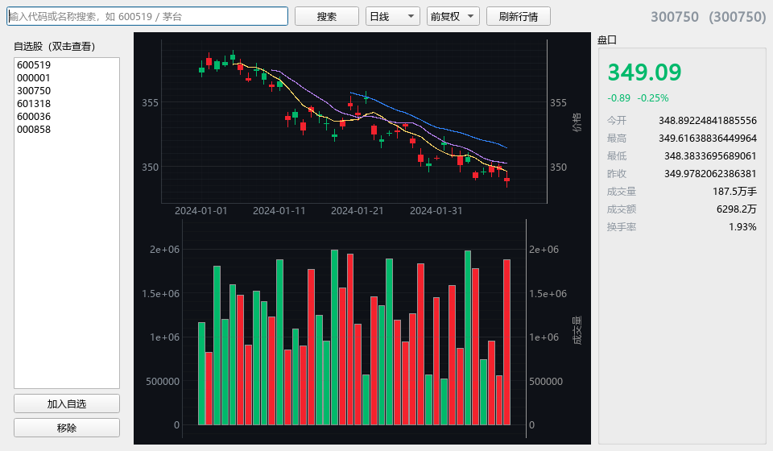

# A股模拟交易终端（cn-stock-desktop）

桌面级 A 股模拟交易终端：**行情看盘 · 模拟交易 · 量化回测**，开箱即用、双击即跑。

> 纯本地、纯模拟，**不涉及任何真实资金与券商接口**。所有交易为「纸面撮合」，用于学习 A 股交易规则与策略验证。

---

## 界面预览

| 总览（行情中心） | 模拟交易 | 量化回测 |
|:---:|:---:|:---:|
|  |  |  |
|  | | |

暗色金融主题、涨红跌绿 A 股配色；K 线 + 均线 + 成交量叠合；盘口实时更新。

### 多只自选股离屏渲染证据（`scripts/_shot.py`）

直接回应「其他示例股票打不开」的真实渲染快照（**离屏、无需联网**）：

| 600519 贵州茅台 | 000001 平安银行 | 300750 宁德时代 |
|:---:|:---:|:---:|
|  |  |  |

每只票独立标题 / 独立价格区间 / 独立 K 线形态 / 独立盘口数字——快速切换不串味、不打不开。
本地重跑：`python scripts/_shot.py`（输出到 `docs/screenshots/market_proof_*.png`）。

---

## 功能特性

| 模块 | 能力 |
|------|------|
| **行情中心** | 代码/名称搜索、自选股、日/周/月/分钟线、前/后复权、K 线 + 均线 + 成交量、实时盘口 |
| **模拟交易** | 限价/市价委托、账户总览、持仓、当日委托、成交记录、撤单、账户重置 |
| **量化回测** | 内置 6 大策略（双均线/RSI/布林/MACD/网格/买入持有）、参数可调、绩效指标 + 资金曲线 + 成交明细 |

### 严格遵循 A 股规则
- **T+1**：当日买入次日方可卖出（持仓自动锁定）
- **涨跌停**：涨停拒买、跌停拒卖
- **最小单位**：买入须为 100 股整数倍
- **费用**：佣金（万 2.5，最低 5 元）+ 印花税（卖出单边千 0.5）+ 过户费（双边万 0.1）
- **配色**：涨红跌绿（A 股约定）

### 数据源
- **主源 akshare**（免费、无需注册）+ **备源 Tushare**（可选，填 token）
- 主备自动降级；SQLite 缓存历史数据，断网也能看旧图

---

## 配置说明（可选）

配置文件位于 `%APPDATA%\cn-stock-desktop\config.json`，首次启动自动生成，修改保存即生效（部分项支持运行时热更新，无需重启）。

`data` 相关核心配置项：

| 配置项 | 默认 | 说明 |
|------|------|------|
| `primary` / `fallback` | `akshare` / `tushare` | 主/备数据源，主失败自动降级 |
| `tushare_token` | 空 | 备源 token（可选，留空则 Tushare 不可用） |
| `cache_enabled` / `cache_ttl_days` | `true` / `7` | 历史数据 SQLite 缓存（天） |
| `realtime_ttl_seconds` | `15` | manager 层实时行情内存缓存有效期（秒） |
| `spot_ttl_seconds` | `30` | provider 层全市场快照缓存有效期（秒），**必须 ≥ `realtime_ttl_seconds`**，否则缓存穿透、每次刷新都重拉约 59 个分页请求 |
| `request_timeout` | `20` | 单次行情请求超时（秒）；超时后进入失败冷却，不再傻等一个完整连接 |
| `realtime_per_symbol` | `false` | **实验性**单票实时快路径（见下） |

### 实验性：`realtime_per_symbol`（默认关闭）

默认关闭。开启后，实时行情对自选股（通常个位数）**逐只**调用东财 `stock_bid_ask_em`（每只 1 个 HTTP 请求），不再拉全市场快照（一次约 59 个分页请求）——请求量随自选股数量线性增长，与全市场总票数无关。

- **安全回退**：任意异常或空返回都会自动回退到全市场快照，因此开启它**绝不会比现状更差**；
- **需联网验证**：该接口返回长表（item/value），字段映射在离线环境无法端到端确认，故默认关闭。联网后如想降低延迟，可手动设为 `true` 并观察日志确认报价正确后再长期使用；
- 未实现该接口的备源（如 Tushare）会自动退回全市场快照，不受影响。

---

## 安装与运行（开发模式）

需要 Python ≥ 3.10（已在 3.13.14 验证）。

```bash
# 1. 创建并激活虚拟环境
python -m venv .venv
.venv\Scripts\activate        # Windows
# source .venv/bin/activate   # macOS / Linux

# 2. 安装依赖
pip install -r requirements.txt

# 3. 启动
python -m cnstock
```

或直接使用 `run.bat`（首次运行会自动建环境并装依赖）。

---

## 打包为单文件 exe（交付形态）

目标：**双击即跑，无需安装 Python**。

```bash
build.bat
```

产物位于 `dist\A股模拟交易终端.exe`。配置与数据库写入用户目录
`%APPDATA%\cn-stock-desktop\`，不影响安装位置。

---

## 自动构建（GitHub Actions）

仓库已内置 `.github/workflows/build.yml`：

- 推送 `v*` 标签（如 `v1.0.0`）或在 Actions 页手动触发，**自动在 Windows runner 上打包 `A股模拟交易终端.exe`**；
- tag 触发时自动发布到对应 GitHub Release（作为附件上传），并生成变更说明；
- 任意触发都会保留一次构建产物（Artifact）供下载。

```bash
git tag v1.0.0
git push origin v1.0.0
```

> 本地已有的 `dist/A股模拟交易终端.exe`（≈72MB）可直接手动上传到 Release，无需等待 CI。

---

## 命令行回测（无需 GUI）

```bash
python scripts/cli_demo.py 600519 --strategy 双均线交叉 --years 3
python scripts/cli_demo.py 300750 --strategy MACD 背离 --cash 500000
```

---

## 目录结构

```
cn-stock-desktop/
├── cnstock/
│   ├── core/          # 配置、A股规则常量、领域模型
│   ├── data/          # 数据源抽象 + akshare/tushare + 缓存 + 调度器
│   ├── engine/        # 模拟撮合引擎（SimBroker）
│   ├── backtest/      # 回测引擎、策略库、绩效指标
│   ├── storage/       # SQLite 持久化
│   ├── ui/            # 主题、K线图表、主窗口、三个业务视图
│   │   └── widgets/   # 行情 / 交易 / 回测 三个视图
│   ├── __main__.py    # python -m cnstock 入口
│   └── main.py        # 应用主入口（setup logging + QApp + MainWindow）
├── scripts/
│   ├── cli_demo.py    # 命令行回测（无需 GUI）
│   ├── make_screenshots.py  # README 截图生成（离屏、零联网）
│   ├── _smoke.py      # 冒烟测试：撮合/回测/绩效（离线可跑）
│   ├── _verify.py     # 回归测试：持久化/视图渲染/缓存/降级/单票快路径/多标加载（离线可跑）
│   └── _shot.py       # 离屏渲染证据：多只自选股逐一截图，证明切换不串味（离线可跑）
├── docs/
│   └── screenshots/   # README 截图 + 自选股渲染证据（market_proof_*.png）
├── launcher.py        # PyInstaller 冻结入口（修复包内相对导入）
├── build.py           # PyInstaller 打包脚本（绕过 Windows .bat 中文 codepage 炸）
├── run.py             # 首启建 venv + 装依赖 + 启动
├── build.bat          # 纯 ASCII 引导：调用 build.py
├── run.bat            # 纯 ASCII 引导：调用 run.py
├── requirements.txt
├── requirements-build.txt
└── .github/workflows/build.yml   # GitHub Actions：自动打包并发布 exe
```

> **README 截图如何本地重新生成**：
> ```bash
> python scripts/make_screenshots.py   # 输出到 docs/screenshots/00-03-*.png
> python scripts/_shot.py              # 输出到 docs/screenshots/market_proof_*.png
> ```
> 完全离屏运行、不联网、不写用户真实账户库。

---

## 架构分层（前后端边界）

本项目桌面端是**单体应用**，所有代码跑在**同一个进程内**。但业务职责严格分层，**纯逻辑层完全不依赖 GUI**；并额外提供了可选的服务端入口 `cnstock/api`（FastAPI），把同一套逻辑层暴露成 REST API，作为桌面 UI 之外的另一个消费者：

| 层 | 目录 | 代码量 | 依赖 |
|---|---|---|---|
| 前端 UI | `cnstock/ui` | 1,873 行 | PyQt6 / pyqtgraph |
| **后端逻辑** | `cnstock/core` + `data` + `engine` + `backtest` + `storage` | **3,763 行（67%）** | 仅 stdlib + numpy / pandas |
| API 服务 | `cnstock/api` | ~505 行（新增） | FastAPI（Qt-free） |

后端五层（`core`/`data`/`engine`/`backtest`/`storage`）与 API 服务层（`api`）**零 PyQt 引用**，可独立运行、可被 FastAPI 等框架包裹成服务端。边界由 `scripts/_verify.py` 的 **[8] 后端边界守卫** + **[9] API 层无头冒烟** 锁定：

- **静态**：源码扫描 import 语句，任何 PyQt6 / pyqtgraph 导入立即报错；
- **动态**：子进程跑 `scripts/headless_demo.py`（自带 Qt 导入阻断器），仍须完整跑通撮合 + 6 策略回测 + 持久化 + 指标；
- **API 实测**：子进程装 Qt 阻断器后 import `cnstock.api.app`，用 TestClient 把 health / strategies / backtest / account / order / price-limit 全部打一遍。

### 无头运行验证

```bash
python scripts/headless_demo.py     # 退出 0 = 纯逻辑层零 GUI 依赖
```

该脚本在 import 任何业务模块**之前**就往 `sys.meta_path` 装阻断器，凡是要 import `PyQt6.*` / `pyqtgraph.*` 一律抛 `ImportError`；在这种"没有 Qt"的环境里跑完真实撮合（T+1 / 涨跌停 / 整百 / 资金校验）、6 策略回测、SQLite 持久化、绩效指标。

### REST API 服务（已实现）

纯逻辑层已套一层 FastAPI（`cnstock/api`），可作为独立服务端运行——**零 Qt 依赖**，
服务端镜像只需 `requirements-api.txt` 即可，无需安装 PyQt6 / pyqtgraph。

启动：

```bash
pip install -r requirements-api.txt
python -m cnstock.api                 # 默认 :8000，交互式文档见 http://localhost:8000/docs
# 或：CNSTOCK_API_PORT=9000 python scripts/serve.py
```

状态库默认当前目录 `server_state.db`，可用环境变量 `CNSTOCK_API_DB` 覆盖（避免与桌面端 `data.db` 冲突）。

主要接口（前缀 `/api`）：

| 方法 | 路径 | 说明 |
|------|------|------|
| GET  | `/api/health` | 健康检查 |
| GET  | `/api/strategies` | 策略目录（含参数规范） |
| POST | `/api/backtest` | 单策略回测（上传 OHLCV） |
| POST | `/api/backtest/all` | 全部策略批量回测 |
| GET  | `/api/account` | 账户快照 |
| GET  | `/api/positions` | 持仓列表 |
| POST | `/api/orders` | 提交委托（离线需带 `quote`） |
| GET  | `/api/orders` / `/api/trades` | 委托 / 成交列表 |
| POST | `/api/orders/{id}/cancel` | 撤单 |
| POST | `/api/settlement` | 日终结算（T+1 解锁） |
| POST | `/api/account/reset` | 重置账户 |
| GET  | `/api/price-limit` | 涨跌停计算工具 |
| POST | `/api/metrics` | 绩效指标计算 |

> 离线环境下下单必须随请求携带 `quote: {price, prev_close, name?}`，否则以「未获取到行情」拒单。

无头验证（含 API 层）：

```bash
python scripts/_verify.py      # [8] 后端边界守卫 + [9] API 层无头冒烟，共 31 项断言
python scripts/api_smoke.py     # 单独跑 API 层无头冒烟（自带 Qt 阻断器）
```

逻辑层无需改动即可复用——这正是分层的目的。

### 依赖拆分

- `requirements.txt`：完整依赖（含 GUI）
- `requirements-core.txt`：纯逻辑层依赖（无 Qt），服务端 / CI / headless 专用
- `requirements-api.txt`：`-r requirements-core.txt` + FastAPI / Uvicorn / HTTPX，服务端镜像专用

---

## 免责声明

本软件仅供学习与策略研究使用，**不构成任何投资建议**。模拟撮合基于历史/实时行情近似，
与真实券商撮合（逐笔、排队、集合竞价）存在差异。据此操作风险自负。

---

如果本项目对你有帮助，欢迎 Star ⭐ 与 Issue。
